<p align="center">

</p>

<h1>On-premises Active Directory Deployed in the Cloud (Azure)</h1>

This tutorial outlines the implementation of on-premises Active Directory within Azure Virtual Machines.<br/>


> <h2>Environments and Technologies Used</h2>

- Microsoft Azure (Virtual Machines/Compute)
- Remote Desktop
- Active Directory Domain Services
- PowerShell

> <h2>Operating Systems Used </h2>

- Windows Server 2022
- Windows 10 (21H2)

> <h2>High-Level Deployment and Configuration Steps</h2>

- Setup Resources in Azure
- Ensure Connectivity between the client and Domain Controller
- Install Active Directory
- Create an Admin and Normal User Account in AD
- Join Client-1 to your domain (mydomain.com)
- Setup Remote Desktop for non-administrative users on Client-1
- Create a bunch of additional users and attempt to log into client-1 with one of the users

> <h2>Deployment and Configuration Steps</h2>

### Setup Resources in azure

1. Create the Domain Controller VM (Windows Server 2022) named “DC-1”


2. Create the Client VM (Windows 10) named “Client-1”. Use the same Resource Group and Vnet that was created in Step 1


3. Set Domain Controller’s NIC Private IP address to be static


4. Ensure that both VMs are in the same Vnet (you can check the topology with Network Watcher

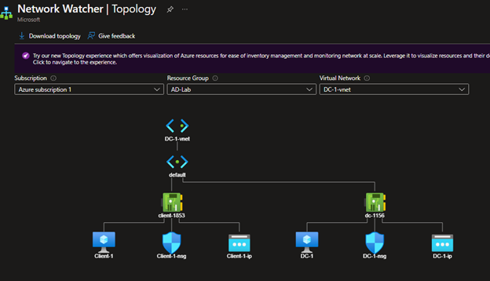

### Ensure Connectivity between the client and Domain Controller

1. Login to Client-1 with Remote Desktop and ping DC-1’s private IP address with ``` ping -t <ip address> ``` (perpetual ping)

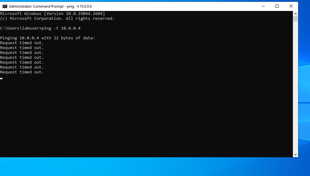

2. Login to the Domain Controller and enable *ICMPv4* in on the local windows Firewall


3. Check back at Client-1 to see the ping succeed

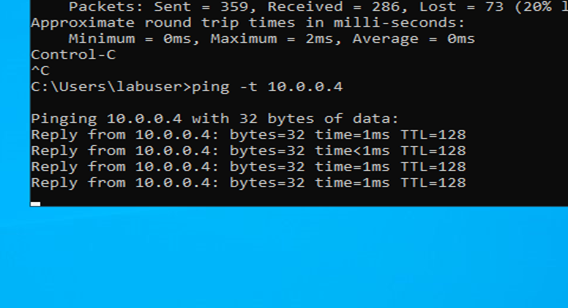

### Install Active Directory

1. Login to DC-1 and install Active Directory Domain Services

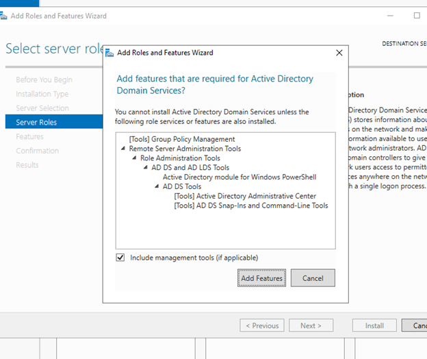

2. Promote as a DC: Setup a new forest as mydomain.com (can be anything, just remember what it is)

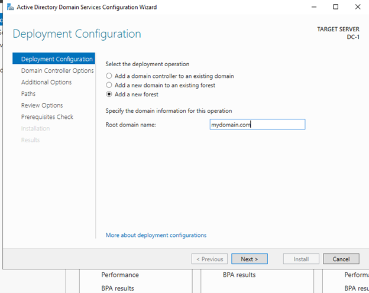

3. Restart and then log back into DC-1 as user: mydomain.com\labuser

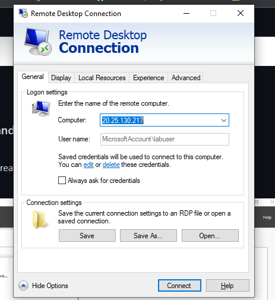

### Create an Admin and Normal User Account in AD

1. In Active Directory Users and Computers (ADUC), create an Organizational Unit (OU) called “_EMPLOYEES”

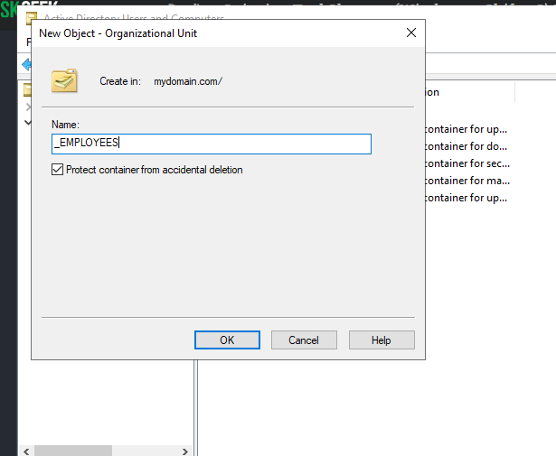

2. Create a new OU named “_ADMINS”

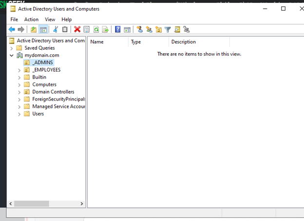

3. Create a new employee named “Jane Doe” (same password) with the username of “jane_admin”

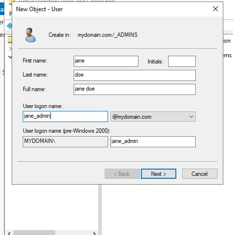

4. Add jane_admin to the “Domain Admins” Security Group


5. Log out/close the Remote Desktop connection to DC-1 and log back in as “mydomain.com\jane_admin”. User jane_admin as your admin account from now on

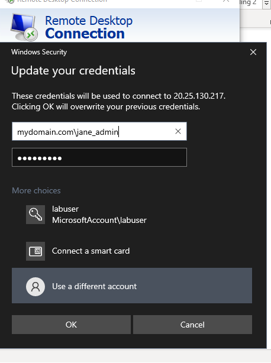

### Join Client-1 to your domain (mydomain.com)

1. From the Azure Portal, set Client-1’s DNS settings to the DC’s Private IP address

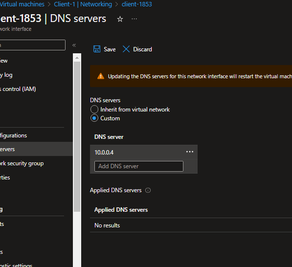

2. From the Azure Portal, restart Client-1
Login to Client-1 (Remote Desktop) as the original local admin (labuser) and join it to the domain (computer will restart)

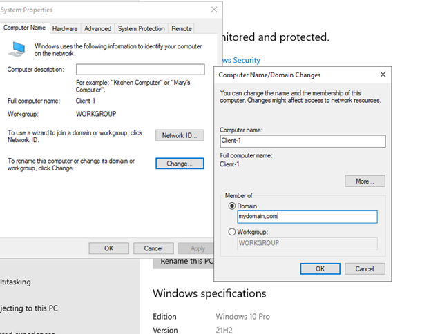

3. Login to the Domain Controller (Remote Desktop) and verify Client-1 shows up in Active Directory Users and Computers (ADUC) inside the “Computers” container on the root of the domain
Create a new OU named “_CLIENTS” and drag Client-1 into there

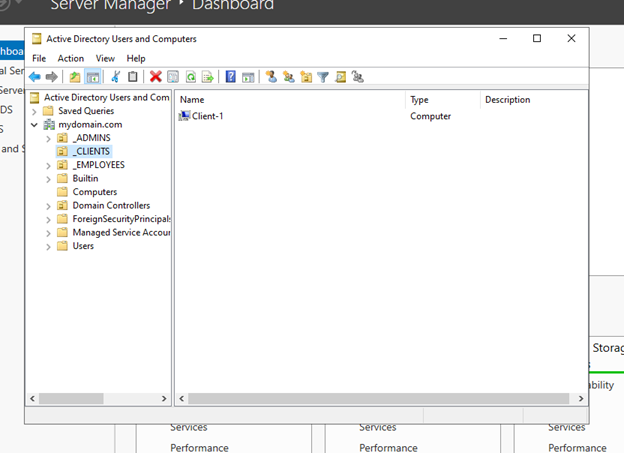

### Setup Remote Desktop for non-administrative users on Client-1

Log into Client-1 as mydomain.com\jane_admin and open system properties

Click “Remote Desktop”

Allow “domain users” access to remote desktop

You can now log into Client-1 as a normal, non-administrative user now
Normally you’d want to do this with Group Policy that allows you to change MANY systems at once (maybe a future lab)


### Create a bunch of additional users and attempt to log into client-1 with one of the users

1. Login to DC-1 as jane_admin

Open PowerShell_ise as an administrator 

Create a new File and paste the contents of the script into it

```  # ----- Edit these Variables for your own Use Case ----- #
$PASSWORD_FOR_USERS   = "Password1"
$NUMBER_OF_ACCOUNTS_TO_CREATE = 10000
# ------------------------------------------------------ #

Function generate-random-name() {
    $consonants = @('b','c','d','f','g','h','j','k','l','m','n','p','q','r','s','t','v','w','x','z')
    $vowels = @('a','e','i','o','u','y')
    $nameLength = Get-Random -Minimum 3 -Maximum 7
    $count = 0
    $name = ""

    while ($count -lt $nameLength) {
        if ($($count % 2) -eq 0) {
            $name += $consonants[$(Get-Random -Minimum 0 -Maximum $($consonants.Count - 1))]
        }
        else {
            $name += $vowels[$(Get-Random -Minimum 0 -Maximum $($vowels.Count - 1))]
        }
        $count++
    }

    return $name

}

$count = 1
while ($count -lt $NUMBER_OF_ACCOUNTS_TO_CREATE) {
    $fisrtName = generate-random-name
    $lastName = generate-random-name
    $username = $fisrtName + '.' + $lastName
    $password = ConvertTo-SecureString $PASSWORD_FOR_USERS -AsPlainText -Force

    Write-Host "Creating user: $($username)" -BackgroundColor Black -ForegroundColor Cyan
    
    New-AdUser -AccountPassword $password `
               -GivenName $firstName `
               -Surname $lastName `
               -DisplayName $username `
               -Name $username `
               -EmployeeID $username `
               -PasswordNeverExpires $true `
               -Path "ou=_EMPLOYEES,$(([ADSI]`"").distinguishedName)" `
               -Enabled $true
    $count++
}
```


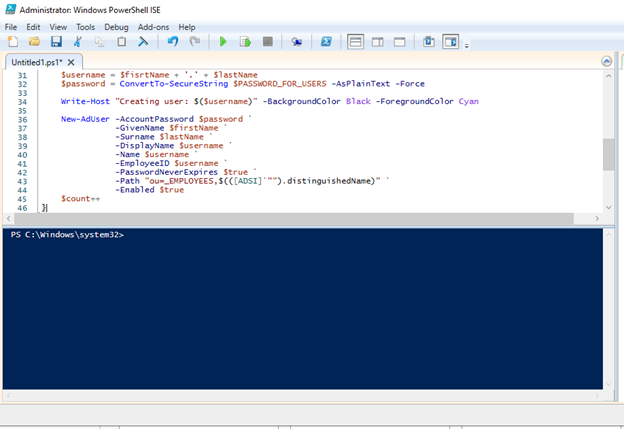

2. Run the script and observe the accounts being created

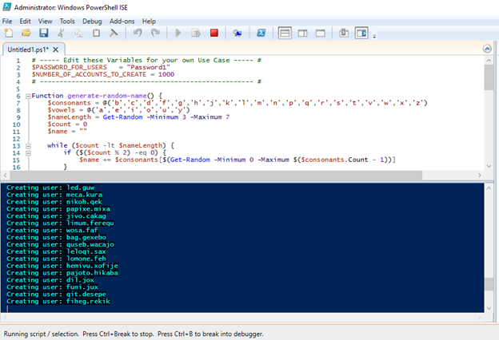

3. When finished, open ADUC and observe the accounts in the appropriate OU and attempt to log into Client-1 with one of the accounts (take note of the password in the script)


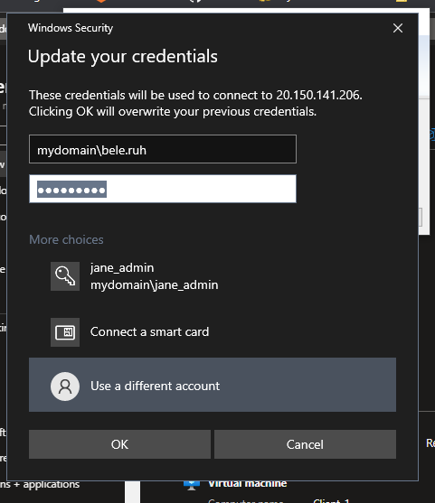

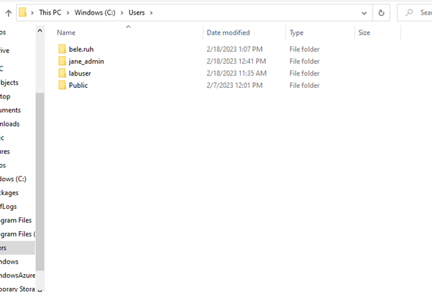

:bulb: **Tip:**  At the end, do not forget to **clean up** your resources in the Azure Portal.


